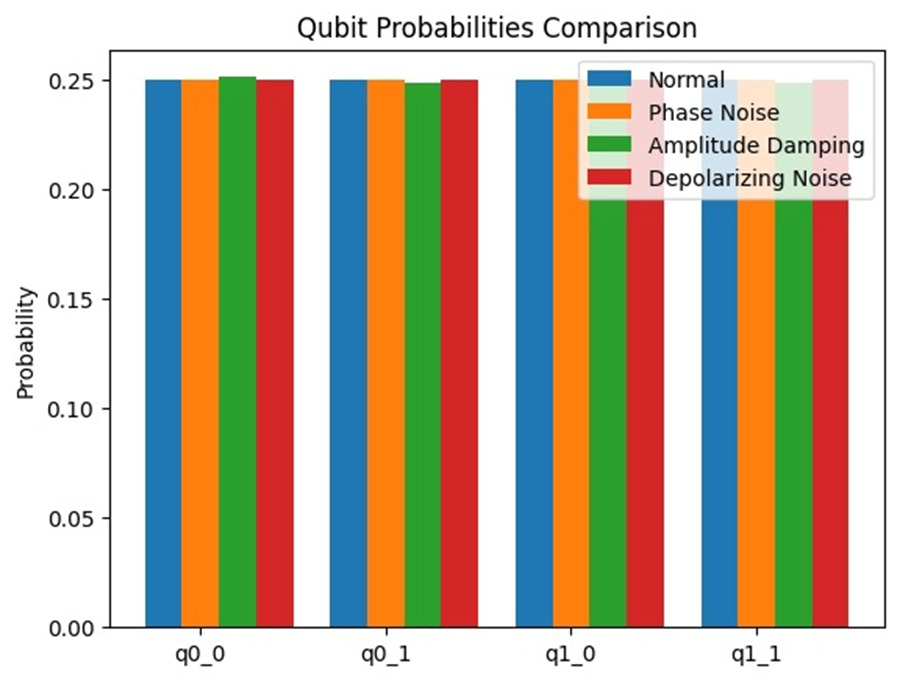
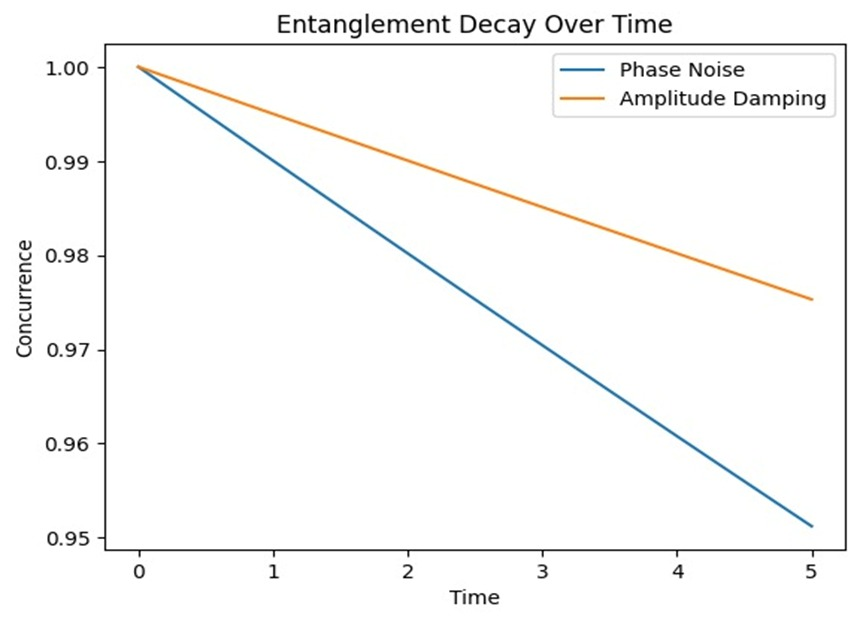
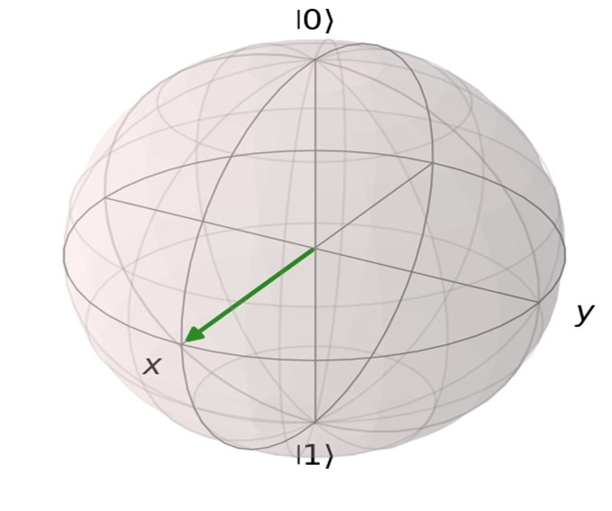

---

# Quantum State Evolution and Decoherence Simulation

A final year project for the **Master of Computer Applications (MCA)** program at **Amrapali University, Haldwani**.

This project focuses on **simulating the fundamental principles of quantum computing**, specifically the **evolution of quantum states** and the **effects of environmental noise (decoherence)** on these states.
Using **Python** and the **QuTiP library**, the simulation visualizes how quantum information degrades under different noise models, highlighting one of the core challenges in building **reliable quantum hardware**.

---

## 🚀 Key Features

* **Qubit State Simulation:**
  Simulates and visualizes basic qubit states in an ideal, noise-free environment.

* **Noise Modeling:**
  Implements quantum noise channels such as:

  * Bit-flip
  * Phase-flip
  * Amplitude damping

* **Decoherence Visualization:**
  Compares noise-free and noisy state behaviors using:

  * Bloch Sphere
  * Graphs and plots for detailed insights

* **Educational Tool:**
  Helps learners and researchers understand:

  * Quantum noise
  * Quantum error correction
  * Real-world challenges in quantum computing

---

## 📊 Project Visualizations

### 1. Qubit Probabilities Comparison

Bar chart showing how qubit probabilities change under different noise conditions.

*Example visualization:*


---

### 2. Entanglement Decay Over Time

Graph illustrating the **loss of entanglement** as the system is subjected to **phase noise** and **amplitude damping** over time.

*Example visualization:*


---

### 3. Bloch Sphere Representation

The **Bloch Sphere** is used to visualize the state vector of a qubit and its transformation under noise.



---

## 🛠️ Technologies Used

| Technology             | Purpose                                           |
| ---------------------- | ------------------------------------------------- |
| **Python**             | Core programming language                         |
| **QuTiP**              | Simulation of quantum systems                     |
| **NumPy**              | Numerical computations                            |
| **Matplotlib**         | Graphs and visualizations                         |
| **Jupyter Notebook**   | Interactive development environment               |
| **React.js / Flutter** | Planned for future web & mobile interfaces        |
| **Power BI**           | Planned for advanced data analytics and reporting |

---

## ⚙️ Installation & Setup

Follow these steps to set up and run the project locally:

### 1. Clone the repository

```bash
git clone https://github.com/Akhilesh2004NSBW/Quantum-State-Evolution-and-Decoherence.git
```

### 2. Navigate to the project folder

```bash
cd Quantum-State-Evolution-and-Decoherence
```

### 3. Install the required dependencies

```bash
pip install qutip numpy matplotlib jupyter
```

### 4. Launch Jupyter Notebook

```bash
jupyter notebook
```

---

## 📘 Full Project Report

For a complete explanation of the project, including:

* Problem Statement
* Project Methodology
* Results and Visualizations
* Future Scope

Please refer to the full report:  
**[Quantum State Evolution and Decoherence Simulation.pdf](Project%20Report/Quantum%20State%20Evolution%20and%20Decoherence%20Simulation.pdf)**

---

## ⚠️ Disclaimer

This project is a **personal academic work** and is **not officially licensed by Amrapali University**.
The code and report are provided **solely for educational and portfolio purposes**.

---

## 👨‍💻 Author

**Akhilesh Pant**

* MCA Student, Amrapali University, Haldwani
* Email: [akhileshpant@gmail.com](mailto:akhileshpant@gmail.com)
* GitHub: [github.com/your-username](https://github.com/your-username)

---

## 🌟 Contributing

Contributions are welcome!
If you’d like to improve this project:

1. **Fork the repository**
2. **Make your changes**
3. **Submit a pull request**

---

## 📜 License

This project is open-source and available under the **MIT License**.

---

## ⭐ Support

If you found this project helpful, please **star the repository** to show your support!

---


